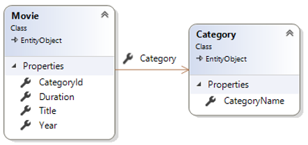
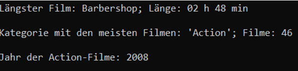
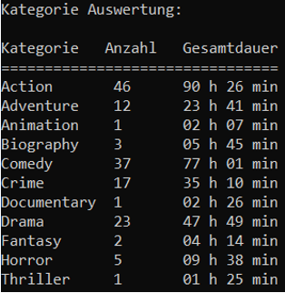
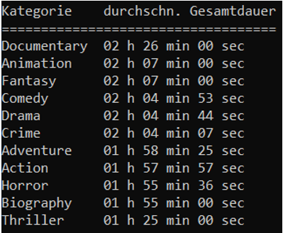

# Movie Manager

## Lehrziele

* Entity Framework Core
* Unit of Work / Repositories
* CSV-Dateien
* LINQ

Die Daten einer Filmdatenbank liegen als csv-Datei vor. Sie sind im `ImportController` einzulesen und werden von der `ImportConsole` in die Datenbank geschrieben.

Ihre Aufgabe ist es, die Filme bzw. deren Kategorien anhand von LINQ-Abfragen zu analysieren. Für den Core-Layer und die Persistenzschicht ist der Rahmen bereits angelegt.

Der `ConnectionString` ist in den einzelnen Projekten bereits angelegt.

## Core

Die Entitätsklassen sind bereits angelegt. Auch die Annotationen zur Definition (inkl. der Migrationen) der Datenbank sind bereits implementiert.

Die Klasse `Movie` verwaltet die Informationen zu einem konkreten Film inkl. dem Verweis auf die Kategorie (`Category`) des Films.

Im Core-Layer sind die Contracts für die Repositories bedarfsgerecht zu erweitern. Die leeren Interfaces sind bereits vorgegeben.

## Import

Es sind die 148 Filme in 11 Kategorien aus der Datei `Movies.csv` zu importieren.

## Persistence

Die Migration wurde bereits angelegt und muss nur verwendet werden, wenn an den Entitätsklassen Änderungen vorgenommen werden:

* Persistence als StartupProject 
* `Add-Migration InitialMigration`
* `UpdateDatabase` mit Kontrolle, ob DB angelegt wurde
* Die Daten über die `ImportConsole` importieren.

Die Repositories müssen noch um die benötigten Methoden erweitert werden.

## Analyse

Zusätzlich zum Import der Daten werden in der `ImportConsole` noch folgende Statistiken/Kennzahlen errechnet:

1.	**Längster Film**
      
    Sollte es hier mehrere potentielle Ergebnisse geben, so muss der erste lt. alphabetischer Sortierung des Filmtitels angedruckt werden.

2.  **Kategorie mit den meisten Filmen**

    Sollte es hier mehrere potentielle Kategorien geben, so muss die erste lt. alphabetischer Sortierung der Kategorie angedruckt werden.

3.	**Jahr der Action Filme**

    In welchem Jahr existieren die meisten Filme der Kategorie *Action*?

    
    
4.	**Statistik der Kategorien (Teil1)**

    * Spalten
       1. Kategorie
       2. Gesamtanzahl der Filme der Kategorie
       3. Gesamtdauer der Filme der Kategorie (in Stunden und Minuten)
   
    * Sortierung
       1. Kategorie (aufsteigend)

     

5.	**Statistik der Kategorien (Teil2)**

    * Spalten
       1. Kategorie
       2. Durchschnittliche Gesamtdauer der Filme der Kategorie (in Stunden, Minuten und Sekunden)
   
    * Sortierung:
       1. Durchschnittliche Gesamtdauer (absteigend)

     
 
